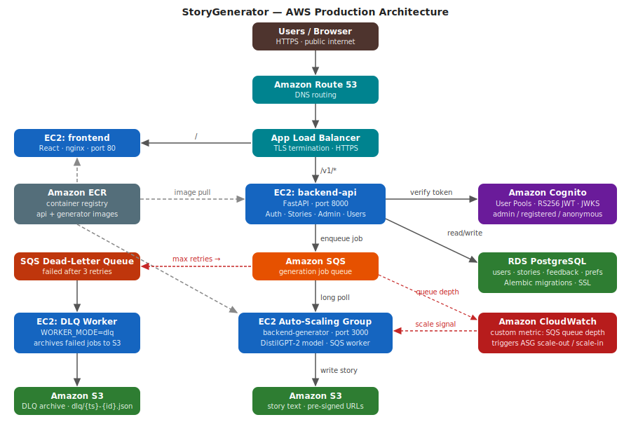

# StoryGenerator

An AI-powered short-story generator built as a cloud-native microservices application, originally deployed on AWS. Users submit a prompt, optional genre and style, and receive a story generated by a DistilGPT-2 language model running as an isolated compute service.

---

## Architecture



The production design decouples generation from the API tier behind an SQS queue so the two can scale independently. The generator is compute-heavy (DistilGPT-2 inference); the API is I/O-bound. Keeping them separate means the API stays fast under load while the generator fleet grows or shrinks based on queue depth rather than request rate.

### AWS production topology

| Layer | Service | Detail |
|---|---|---|
| DNS | Route 53 | Routes `storygen.cab432.com` to the ALB |
| Ingress | Application Load Balancer | TLS termination, HTTPS only |
| API | EC2 (backend-api) | FastAPI on port 8000; auth, story CRUD, admin, user preferences |
| Queue | Amazon SQS | Generation jobs enqueued by the API; long-polled by generators |
| Auto-scaling | EC2 Auto-Scaling Group (backend-generator) | Scales on a custom CloudWatch metric: SQS `ApproximateNumberOfMessagesVisible` |
| Model | DistilGPT-2 (HuggingFace Transformers) | Baked into the generator AMI/image at build time; runs CPU inference |
| Storage | Amazon S3 | Story text files at `stories/{user_id}/{story_id}.txt`; pre-signed `GET` URLs (15 min TTL) for downloads |
| Database | RDS PostgreSQL | Users, story metadata, per-story feedback, user preferences; SSL required; Alembic migrations |
| Auth | Amazon Cognito | User Pools with RS256 JWT; `Admin` and `RegisteredUser` groups for RBAC; JWKS verified on every request |
| Dead-letter queue | SQS DLQ | Messages that fail three times leave the main queue; a separate DLQ-mode worker (`WORKER_MODE=dlq`) archives them to S3 (`dlq/{timestamp}-{id}.json`) |
| Container registry | Amazon ECR | Both service images pushed and pulled from ECR |
| Observability | CloudWatch | Custom queue-depth metric drives the generator ASG; heartbeat visibility extension keeps long-running jobs alive |

### Why this design

**Queue-based load levelling** means a burst of story requests does not overwhelm the generator fleet — jobs accumulate in SQS and generators drain them at their own pace. The custom CloudWatch metric (queue depth per generator instance) gives a tighter scaling signal than CPU alone.

**Separate DB writes** in the API and generator: the generator writes the story file to S3 and inserts metadata to RDS; the API reads metadata and issues pre-signed URLs. No file content ever passes through the API's memory.

**NullPool on the DB engine** prevents connection exhaustion on RDS when multiple generator instances connect simultaneously.

**DLQ archiving** preserves failed job bodies in S3 for post-mortem analysis without re-queuing them.

---

## Tech stack

**Backend API** (`backend-api/`) — Python 3.12, FastAPI, SQLAlchemy 2 (NullPool), psycopg2, python-jose, passlib/bcrypt, httpx, boto3

**Generator service** (`backend-generator/`) — Python 3.12, FastAPI, HuggingFace Transformers 4.44, PyTorch 2.3 (CPU), boto3

**Frontend** (`frontend/`) — React 18, Vite 7, Mantine UI 8, Axios, React Router 7

**Infrastructure** — PostgreSQL 14, nginx (reverse proxy + SPA), Docker / Docker Compose, Amazon ECR

---

## Repository layout

```
.
├── backend-api/            # FastAPI API service (port 8000)
│   ├── app/
│   │   ├── controllers/    # Business logic (auth, story, admin, feedback, user)
│   │   ├── middleware/      # Request middleware
│   │   ├── models/         # SQLAlchemy ORM models (User, StoryMetadata, Feedback, Preferences)
│   │   ├── routes/         # FastAPI routers (/v1/auth, /v1/stories, /v1/admin, /v1/users)
│   │   ├── schemas/        # Pydantic request/response schemas
│   │   ├── security/       # Cognito auth (RS256 JWKS verification)
│   │   ├── services/       # S3 pre-sign, SQS client, external character API, story generation
│   │   ├── storage/        # Storage abstraction (local filesystem or S3)
│   │   └── utils/          # Dependency injection, password hashing, local JWT
│   └── Dockerfile
├── backend-generator/      # DistilGPT-2 generation service (port 3000)
│   ├── app/
│   │   ├── services/       # story_generator.py — model inference
│   │   ├── storage/        # Storage abstraction (local filesystem or S3)
│   │   └── sqs_worker.py   # SQS poll loop + DLQ drain loop
│   └── Dockerfile          # Downloads and bakes DistilGPT-2 weights at build time
├── frontend/               # React + Vite SPA, served by nginx on port 5000
│   ├── src/
│   │   ├── pages/          # GenerateStory, MyStories, Profile, AdminPanel, Login, Register
│   │   └── api/            # Axios client + endpoint definitions
│   ├── nginx.conf          # Proxies /v1/* to backend-api; SPA fallback for all other routes
│   └── Dockerfile          # Multi-stage: npm build → nginx:alpine
├── tests/
│   └── load_test.py        # Locust load test targeting the generate endpoint
├── docker-compose.yml      # Local four-service stack (db, backend-api, backend-generator, frontend)
├── .env.example            # All environment variables with safe placeholder values
└── docs/
    └── architecture-aws.svg
```

---

## API endpoints

All routes are prefixed `/v1`.

| Method | Path | Auth | Description |
|---|---|---|---|
| POST | `/auth/signup` | — | Register a new user |
| POST | `/auth/confirm` | — | Confirm email (Cognito mode) |
| POST | `/auth/login` | — | Log in; returns Bearer JWT |
| POST | `/auth/password/change` | Bearer | Change password |
| POST | `/auth/email/change` | Bearer | Start email change (Cognito mode) |
| POST | `/auth/email/confirm` | Bearer | Confirm email change (Cognito mode) |
| GET | `/users/me` | Bearer | Get own profile |
| PATCH | `/users/me` | Bearer | Update profile |
| GET | `/users/me/preferences` | Bearer | Get default genre/style/length |
| PUT | `/users/me/preferences` | Bearer | Save default preferences |
| DELETE | `/users/me` | Bearer | Delete account and all stories |
| GET | `/users/my-stories` | Bearer | List own stories (filterable by genre/style, sortable, paginated) |
| POST | `/stories/generate` | Optional Bearer | Generate a story; saves to DB if authenticated |
| GET | `/stories/{id}` | Bearer | Read story text |
| DELETE | `/stories/{id}` | Bearer | Delete a story |
| POST | `/stories/{id}/feedback` | Bearer | Submit a 1–5 star rating |
| GET | `/stories/{id}/feedback` | Bearer | List feedback for a story |
| GET | `/stories/{id}/download-url` | Bearer | Get a pre-signed S3 download URL |
| GET | `/admin/users` | Admin | List all users |
| GET | `/admin/stories` | Admin | List all stories |
| DELETE | `/admin/users/{id}` | Admin | Delete user and cascade |

The generator service exposes a single internal endpoint: `POST /v1/generate` (called by the API in local mode; called via SQS in production).

---

## Running locally

The local stack replaces AWS services with in-process equivalents controlled by environment variables. The architecture and all AWS code paths remain in the codebase — only the active runtime path changes.

| Variable | Local value | AWS production value |
|---|---|---|
| `AUTH_PROVIDER` | `local` (HS256 JWT) | `cognito` (RS256, JWKS) |
| `QUEUE_BACKEND` | `none` (direct HTTP) | `sqs` |
| `STORY_STORAGE` | `local` (Docker volume) | `s3` |
| `DB_SSLMODE` | `disable` | `require` |

### Prerequisites

- Docker Desktop (or Docker + Docker Compose v2)

### Start

```bash
docker compose up --build
```

First run downloads and caches the DistilGPT-2 weights inside the generator image (~350 MB). Subsequent builds use the Docker layer cache.

| Service | URL |
|---|---|
| Frontend | http://localhost:5000 |
| API (FastAPI docs) | http://localhost:8000/docs |
| Generator (internal) | http://localhost:3000 |
| PostgreSQL | localhost:5432 |

### Environment

Copy `.env.example` to `.env` and set at minimum:

```bash
JWT_SECRET=your-secret-here   # any random string for local use
```

All other variables have working defaults in `docker-compose.yml`.

### Stop and reset

```bash
docker compose down          # stop containers, keep data volumes
docker compose down -v       # stop and delete all data (pgdata + storydata)
```

---

## Originally deployed on AWS

This project was built and deployed on AWS as part of QUT unit. The AWS infrastructure (RDS, Cognito user pool, SQS queues, S3 bucket, EC2 instances, ALB, Route 53 zone, ECR repositories) has since been decommissioned. The AWS code paths (Cognito auth, SQS worker, S3 storage, pre-signed URL generation, DLQ archiving) are preserved in the codebase and can be re-enabled via environment variables against any AWS account.
